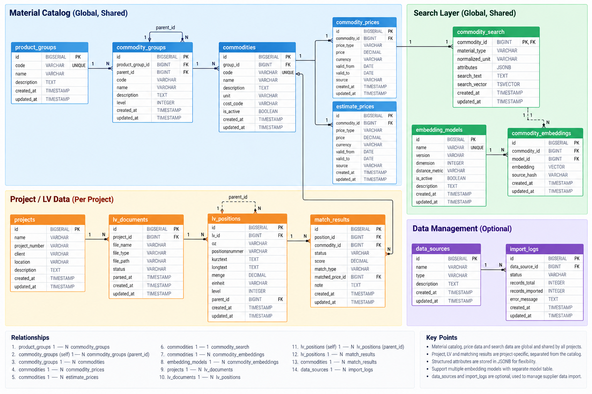

# CostPilot Database Design

The CostPilot backend uses one shared PostgreSQL database.  
`projects` only stores the project records created from the frontend. All projects use the same global material catalog and search data for matching.



## Core Design

The existing catalog tables remain the **source of truth** for imported supplier data:

`product_groups` → `commodity_groups` → `commodities` → prices.

Search-specific data is kept separately from the original catalog:

- `commodity_search` stores normalized material information used by structured and keyword retrieval.
- `attributes` uses `JSONB` so different material types can store different structured attributes without adding many nullable columns.
- `search_text` / `search_vector` are used for database-backed keyword search.
- `embedding_models` describes available embedding models.
- `commodity_embeddings` allows the same commodity to store vectors from multiple models. `(commodity_id, model_id)` should be unique.

`data_sources` and `import_logs` are optional operational tables for tracking external catalog sources and import runs.

## Relationships

```text
product_groups
    1 ─── N commodity_groups

commodity_groups
    1 ─── N commodity_groups
            via parent_id

product_groups
    1 ─── N commodities

commodity_groups
    1 ─── N commodities

commodities
    1 ─── N commodity_prices

commodities
    1 ─── N estimate_prices

commodities
    1 ─── 1 commodity_search

commodities
    1 ─── N commodity_embeddings

embedding_models
    1 ─── N commodity_embeddings

data_sources
    1 ─── N import_logs

projects
    independent project registry
```

## Planned Tables

```text
projects

product_groups
commodity_groups
commodities
commodity_prices
estimate_prices

commodity_search
embedding_models
commodity_embeddings

data_sources
import_logs
```

The SQL schema and retrieval indexes will be defined separately after the data model is finalized.
